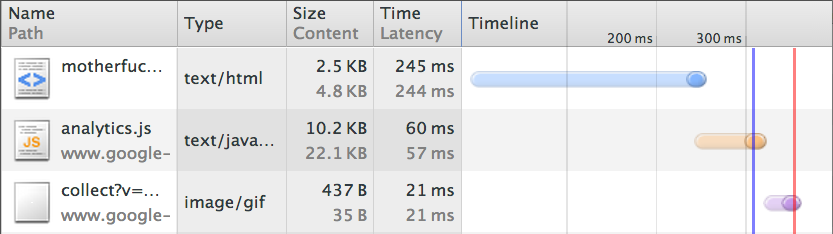
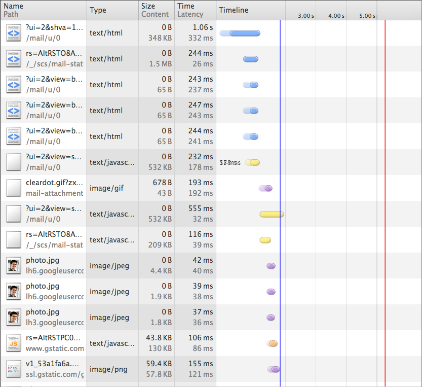
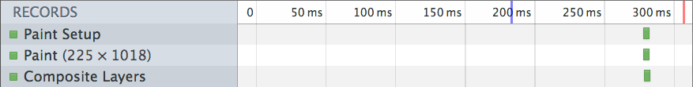
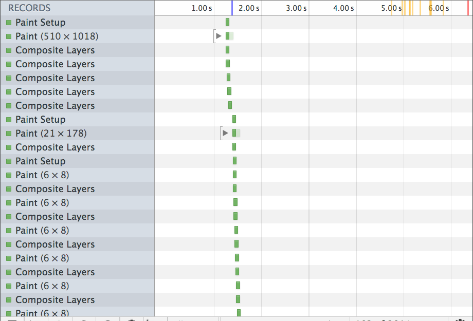
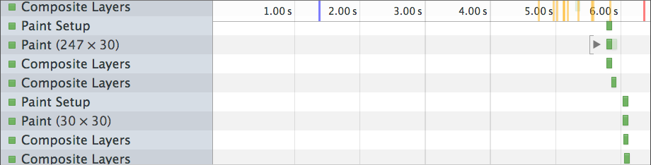

<!SLIDE center red>

# Single-Page App Architecture

## @aidanfeldman

[github.com/afeld/spaa](https://github.com/afeld/spaa)

<!SLIDE green>

# moi

* Education Hacker, [GitHub](https://github.com)
* Instructor, [NYU](http://scps.nyu.edu/)
* Organizer, [Hacker Hours](http://hackerhours.org)
* Author, *[Developing a Backbone.js Edge](http://bleedingedgepress.com/our-books/)*
* Dancer
* Cyclist

<!SLIDE center blue>

How many consider themselves "advanced" in JS?

~~~SECTION:notes~~~

I use airquotes because there's no good way to measure level.

~~~ENDSECTION~~~

<!SLIDE red>

# TODO

* Tradeoffs
* Page load *vroom vroom*
* Data exchange
* Rendering
* JS structure
* JS loading

<!SLIDE center blue>

Going to attempt to hit *every JS-related buzzword* in 45 mins

~~~SECTION:notes~~~

TODO change to a clock icon

~~~ENDSECTION~~~

<!SLIDE center green fun>

But first...

<!SLIDE center blue>

<!SLIDE center red>

# Why!?

<!SLIDE blue>

# The bliss of traditional sites

* Crawlable
* Frequent page loads
* Only load relevant markup/files
* Any language!

~~~SECTION:notes~~~

* [Google's "AJAX crawling"](https://developers.google.com/webmasters/ajax-crawling/)
* Get new code quickly
* Stateless
* [Twitter's "Time to First Tweet"](http://engineering.twitter.com/2012/05/improving-performance-on-twittercom.html)

~~~ENDSECTION~~~

<!SLIDE blue>

# Why client-side?

* `jQuery.html()` doesn't get very far
* Immediate feedback
* Live-updating
* Transitions
* Take rendering load off server\*

~~~SECTION:notes~~~

still need an API

~~~ENDSECTION~~~

<!SLIDE green>

# Hybrid rendering

* Server rendering, client updating
* Can still cache pages
* Options:
    - Shared code on client + server
    - [PJAX](http://pjax.heroku.com/)

~~~SECTION:notes~~~

server renders intial pageload, client handles navigation

~~~ENDSECTION~~~

<!SLIDE center red>

# Page Load Times

<!SLIDE center blue>

## [motherf\*ckingwebsite.com](http://motherfuckingwebsite.com)

~~~SECTION:notes~~~

Network tab in Chrome Dev Tools

~~~ENDSECTION~~~

<!SLIDE center blue>

## GMail

~~~SECTION:notes~~~

DOMContentReady is almost 2s in

~~~ENDSECTION~~~

<!SLIDE center blue>

## [motherf\*ckingwebsite.com](http://motherfuckingwebsite.com)

~~~SECTION:notes~~~

Timeline tab in Chrome Dev Tools

~~~ENDSECTION~~~

<!SLIDE center blue>

## GMail

~~~SECTION:notes~~~

* can't start painting until almost 1.5s in
* page load time affects conversion rates

~~~ENDSECTION~~~

<!SLIDE center blue>

## ...

~~~SECTION:notes~~~

continues painting up past 6s

~~~ENDSECTION~~~

<!SLIDE blue>

# Client⟺Server Data Passing

## Extract from server-rendered DOM

------------

    @@@html
    <h1>
      Welcome, Aidan!
    </h1>
    ...
    <label for="name">Name</label>
    <input type="text" name="name" value="Aidan Feldman" />

<!SLIDE blue>

# Client⟺Server Data Passing

* Extract from server-rendered DOM
    - Which is canonical?

~~~SECTION:notes~~~

TODO show w/ arrow in previous slide

~~~ENDSECTION~~~

<!SLIDE blue>

## Script tags

------------

    @@@html
    

<!SLIDE blue>

# Client⟺Server Data Passing

* Script tags
    - data available immediately
    - tough to do page caching

<!SLIDE blue>

# Client⟺Server Data Passing

## Async

* AJAX
* Web Sockets
    - push support
    - arguably better for notifications than CRUD

<!SLIDE red>

# Templates

* JS-only (browser or NodeJS)
    * [Jade](http://jade-lang.com/), [EmbeddedJS (EJS)](http://embeddedjs.com/), [Underscore](http://documentcloud.github.com/underscore/#template), ...
* Logic-less/language-agnostic template
    * [Mustache](http://mustache.github.com/), [Handlebars](http://handlebarsjs.com/), Liquid
* Shared templates
    * e.g. Jux's gallery CSS

~~~SECTION:notes~~~

TODO add link for Liquid

~~~ENDSECTION~~~

<!SLIDE blue>

# Template Passing

## Script tags

---

    @@@html
    

<!SLIDE blue>

# Template Passing

## Pre-compiled

---

    @@@javascript
    JST = {};
    JST['myTemplate'] = function(context){
      return '
' + context.val + '
';
    };

    var data = { val: 'something' };
    var markup = JST['myTemplate'](data);

<!SLIDE blue>

# Template Passing

* Script tags
* Pre-compiled
* [HTML5 `<template>`](http://www.html5rocks.com/en/tutorials/webcomponents/template/)
    - Chrome only

~~~SECTION:notes~~~

TODO verify still Chrome only, and be clear on difference from `<script>`

~~~ENDSECTION~~~

<!SLIDE red>

# JS Structure

* MVC, MV*
* Routers
    - URL serialization
* Widgets
    - Dojo, jQuery UI

<!SLIDE blue>

# View updating

* Evented
    - Backbone
* Client-side data binding
    - Angular, Ember
* Full-stack data binding
    - [Derby](http://derbyjs.com/), [Meteor](http://meteor.com/)

<!SLIDE blue>

# Evented

## Backbone

    @@@javascript
    var $name = $('.name');
    user.on('change:name', function(user, newName){
      $name.text(newName);
    });

<!SLIDE blue>

# Data binding

## Angular

    @@@html
    <label>Name</label>
    <input type="text" ng-model="yourName"/>

    <h1>Hello {{yourName}}!</h1>

*Look ma, no glue code!*

<!SLIDE center red>

# Asset Loading

<!SLIDE center green fun>

Concatenation + minification.  Duh.

<!SLIDE blue>

# Dependency management

* Module loaders
  - CommonJS
  - Asynchronous Module Definition (AMD)

<!SLIDE blue>

# Dependency management

## RequireJS (AMD)

    @@@javascript
    require(['dependency.js'], function(dependency){

      // do stuff

      dependency.on('someEvent', function(){
        require(['another.js'], function(another){
          another.doStuff();
        });
      });

    });

<!SLIDE blue>

# Package managers

* Think Pip, Maven, Rubygems, etc.
* Jury is out
    * Bower, Jam, Volo, Ender, ComponentJS, NPM
* Good comparison in [Yeoman docs](http://yeoman.io/packagemanager.html)

<!SLIDE blue>

# Add'l resources

* [Single page apps in depth](http://singlepageappbook.com/)
* [Deploying JavaScript Applications](http://alexsexton.com/blog/2013/03/deploying-javascript-applications/)

<!SLIDE center red>

<!SLIDE center red>

# Fin.

## [@aidanfeldman](https://twitter.com/aidanfeldman)

[api.afeld.me](http://api.afeld.me)

[github.com/afeld/spaa](https://github.com/afeld/spaa)
